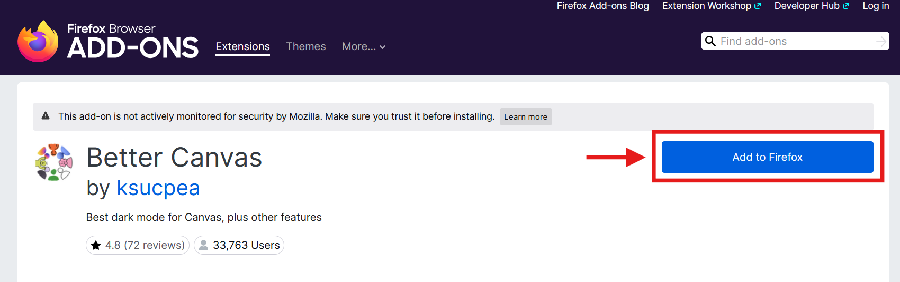
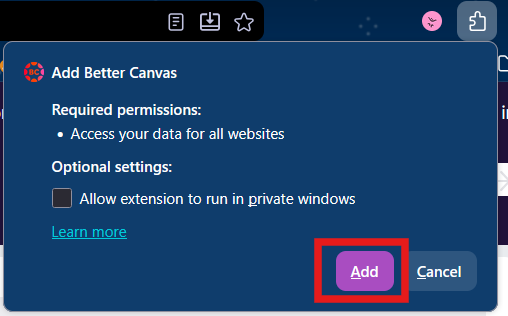
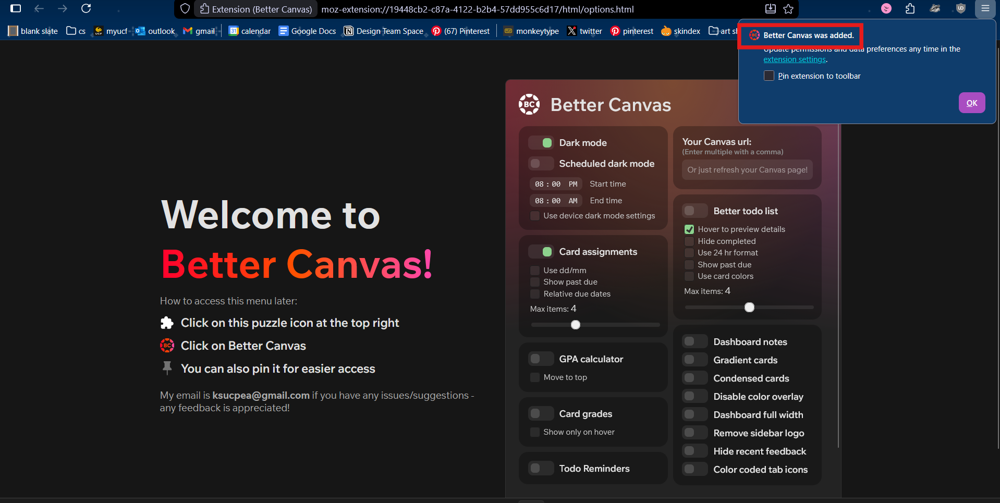
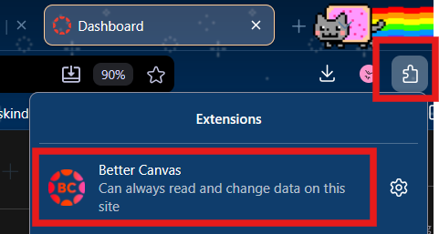
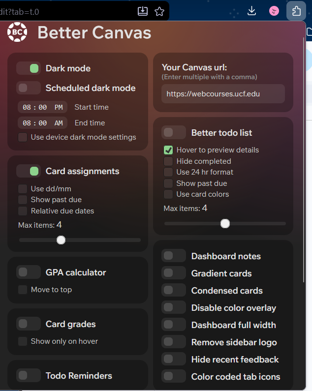
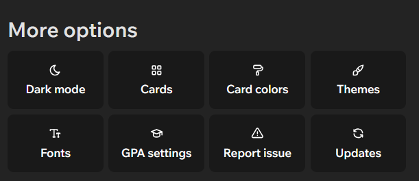

# Instructions

Installing the BetterCanvas Extension for Firefox

This guide will cover the installation of the BetterCanvas extension for Canvas, and assumes you have already installed Firefox (<https://www.firefox.com/>)

### Installation

Step 1: Visit the Better Canvas page on the Firefox Browser Add-Ons & Extensions page:

<https://addons.mozilla.org/en-US/firefox/addon/better-canvas/>

Step 2: On the top-righthand side of the page, click the **Add to Firefox** button (Figure 1).

Figure 1. The "Add to Firefox" button. (Screenshot by Dalia Zamora)

Step 3: When prompted, click **Add**. (Figure 2)

Figure 2. Add Better Canvas prompt. (Screenshot by Dalia Zamora)

Step 4: On the top right-hand side of your screen, click **OK** to dismiss the prompt. (Figure 3)

Figure 3. Prompt displaying Better Canvas was added. (Screenshot by Dalia Zamora)

### Configuring BetterCanvas

Step 5: Click on the puzzle piece icon on the top-righthand side of your screen (Figure 4).

Step 6: Click on "Better Canvas."

Figure 4. Displays puzzle piece icon and Better Canvas extension.

(Screenshot by Dalia Zamora)

Step 7: Select/make desired changes to Canvas from the menu (Figure 5).

Figure 5. Better Canvas configuration options

(Screenshot by Dalia Zamora)

Step 8: Scroll to view more options (Figure 6).

Figure 6. More options

(Screenshot by Dalia Zamora)
